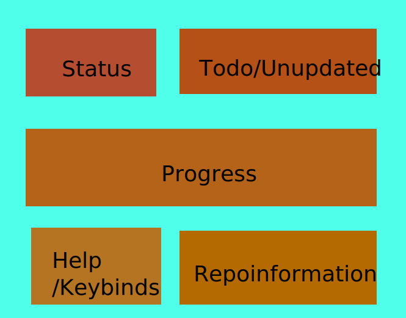

# AlpacaControll

## (A) Arch (L) Linux (pac) Package Repo Control

A Simple Arch Linux Package Repo Tool That auto-compiles Packages on change, Supports different Architectures and makes creating Packages easier in a TUI built with ratatui in Rust. At Least this is the Goal of the Project

No Working Code yet but this is how the TUI should look like.

## Functions

1. [ ] Tui Displays
2. [ ] Initial Setup
3. [ ] Setup Environment from Existing Repo
4. [ ] Status Part
5. [ ] Todo Part
6. [ ] Progress Part
7. [ ] Help/Keybinds Part
8. [ ] Information Part
9. [ ] Package Creation
10. [ ] Autobuild Packages

## I am getting close to the Last year of my apprenticeship as an Electrician so I don't Have much Time yet to build it.